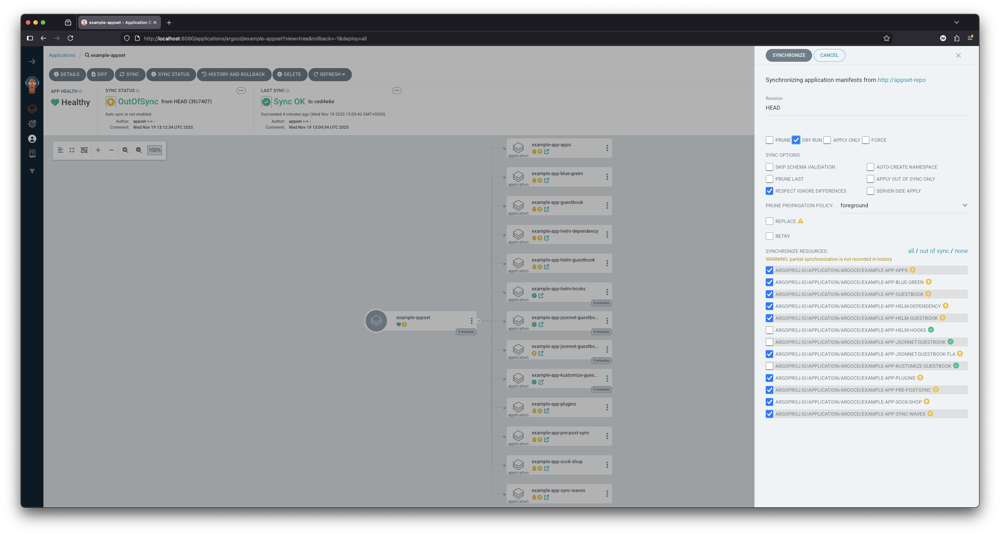
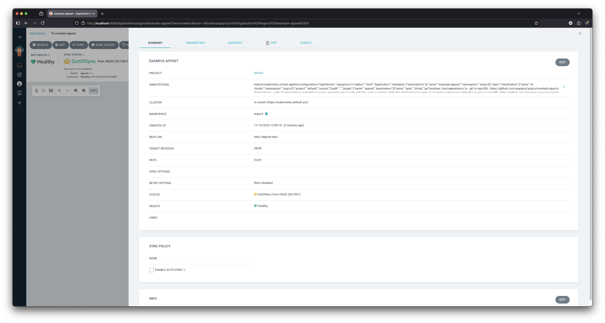

# ArgoCD AppSet Plugin

An alternative implementation of ArgoCD ApplicationSet functionality using a Config Management Plugin approach that addresses operational limitations of the official ApplicationSet controller.

## Overview

ApplicationSet generators and templating are powerful features for dynamically creating multiple Applications. However, the official ApplicationSet controller introduces operational challenges and deviates from ArgoCD's established patterns. This plugin provides ApplicationSet capabilities while maintaining ArgoCD's native Application management experience.

Instead of running a separate controller, it uses ArgoCD's existing mechanisms (manifest caching, interval git polling) and the app-of-apps pattern to achieve the same functionality within ArgoCD's established architecture.

## Key Benefits

- **Native ArgoCD Management**: ApplicationSets appear as regular Applications in the UI with full diff visibility
- **Operational Control**: Pause, sync, and manage child Applications without controller interference
- **Manual Sync Options**: Bulk sync operations with custom sync options like regular app-of-apps
- **No Force-Sync Issues**: Child Applications can be individually managed for testing and hotfixes

## Quick Start

See [INSTALL.md](INSTALL.md) for detailed installation instructions.

## How It Works

The plugin uses a fake git repository (`appset-repo`) as a time-based trigger mechanism which emulates the reconciliation interval of the original controller. When this repository creates new commits at configured intervals, it triggers ArgoCD to refresh Applications using the `appset` plugin, which then generates child Application manifests based on the ApplicationSet specification.

For detailed flow description, see [FLOW.md](FLOW.md).

## Why This Approach?

The official ApplicationSet controller has several operational limitations including lack of management interface, inability to pause force-sync behavior, no diff visibility, and missing manual sync capabilities. This plugin-based approach addresses these issues while maintaining ApplicationSet functionality.

Read more about the motivation behind this project in [MOTIVATION.md](MOTIVATION.md).

## Example

<table style="width: 100%">
<tr>
<th>Official ApplicationSet (for comparison)</th>
<th>Using this plugin (Application with appset plugin)</th>
</tr>
<tr>
<td>

```yaml
apiVersion: argoproj.io/v1alpha1
kind: ApplicationSet
metadata:
  name: example-appset
spec:
  goTemplate: true
  generators:
    - git:
        repoURL: https://github.com/argoproj/argocd-example-apps
        revision: HEAD
        directories:
          - path: '*'
  template:
    metadata:
      name: example-app-{{ .path.path }}
    spec:
      project: default
      destination:
        name: in-cluster
        namespace: default
      source:
        repoURL: https://github.com/argoproj/argocd-example-apps
        path: "{{ .path.path }}"
```

</td>
<td>

```yaml
apiVersion: argoproj.io/v1alpha1
kind: Application
metadata:
  name: example-appset
spec:
  project: default
  destination:
    name: in-cluster
    namespace: argocd
  source:
    repoURL: http://appset-repo
    path: .
    plugin:
      name: appset
      parameters:
        - name: spec
          string: |
            goTemplate: true
            generators:
              - git:
                  repoURL: https://github.com/argoproj/argocd-example-apps
                  revision: HEAD
                  directories:
                    - path: '*'
            template:
              metadata:
                name: example-app-{{ .path.path }}
              spec:
                project: default
                destination:
                  name: in-cluster
                  namespace: default
                source:
                  repoURL: https://github.com/argoproj/argocd-example-apps
                  path: "{{ .path.path }}"
```

</td>
</tr>
</table>

While I apologize for the additional boilerplate code required when using the plugin approach. As shown in the comparison above, the ApplicationSet specification passed to the plugin is identical to the regular ApplicationSet spec - no modifications needed. However, some fields from the original spec might not be respected, since they tell the controller how to act, but they do not affect how generating the manifests works. That's okay because we now have a real Application that can give us the operational functions needed to control everything - and even better!

While the plugin wrapper adds some manifest overhead, I believe the operational benefits (native ArgoCD management, diff visibility, sync control, and manual operations) justify this small amount of additional boilerplate configuration.

## Screenshots

These screenshots demonstrate some of the key benefits mentioned above - native ArgoCD management with sync control and application management screens that are not available with the official ApplicationSet controller.

<table style="width: 100%">
<tr>
<td>

[](screen-1.png)

</td>
<td>

[](screen-2.png)

</td>
</tr>
</table>

## License

MIT
